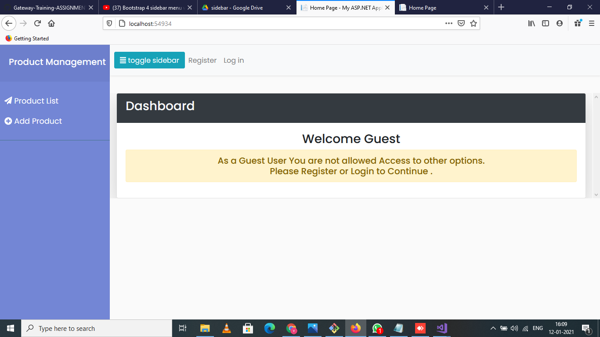
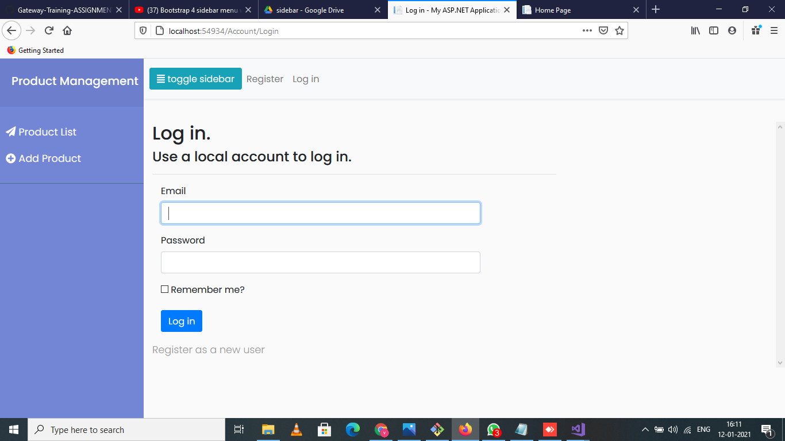
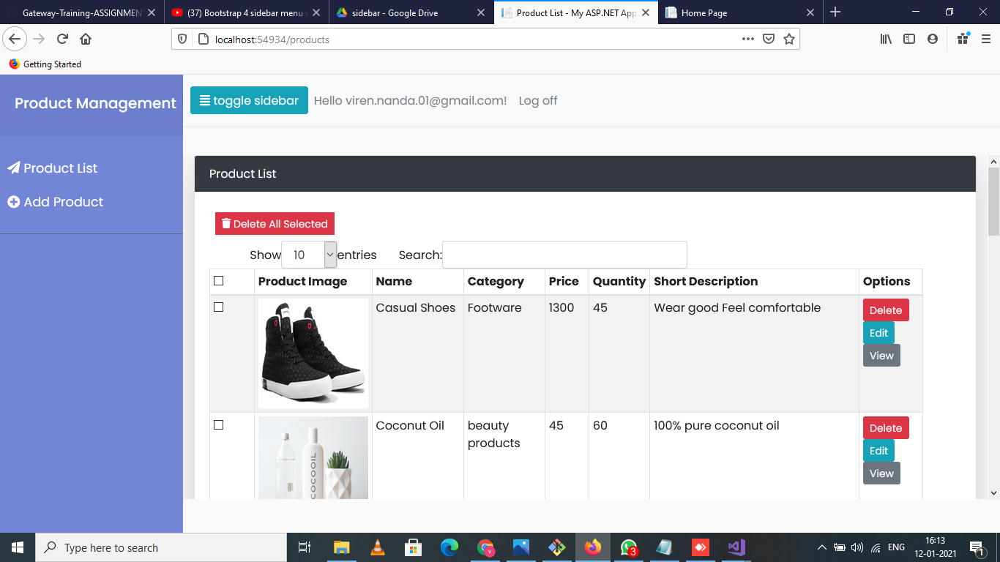
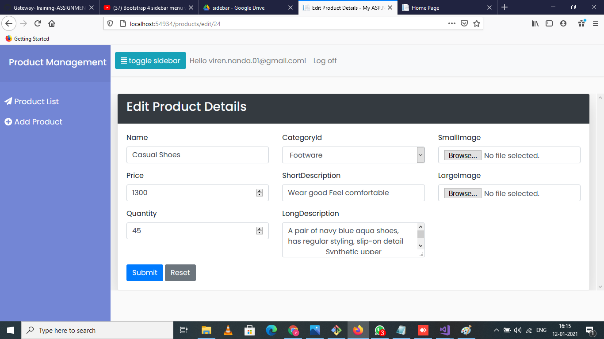
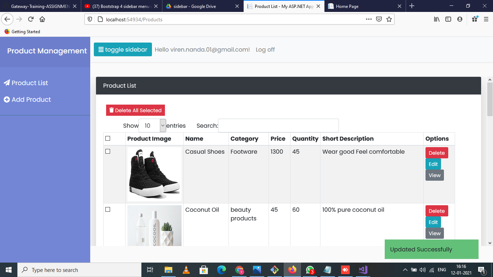

Provide path to Sql server in web.config
both projects require path to same SQL server in web.config

Please Run Migrations to populate database.

screen shots :

Home Page without login 

Login Page

Dashboard :

All Products :

Edit Page:

Updated success notification :

Single Product display:

